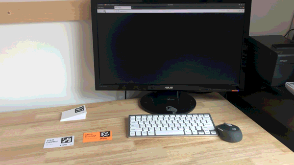
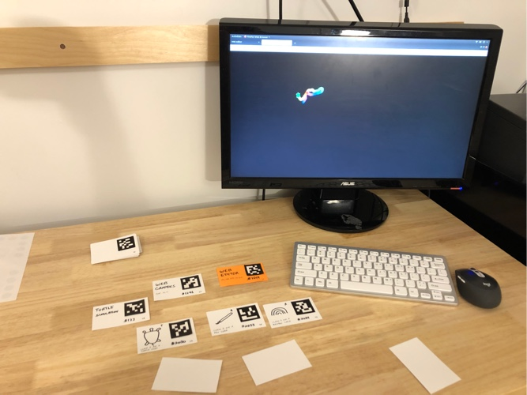
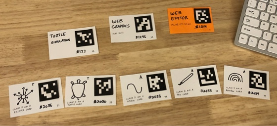
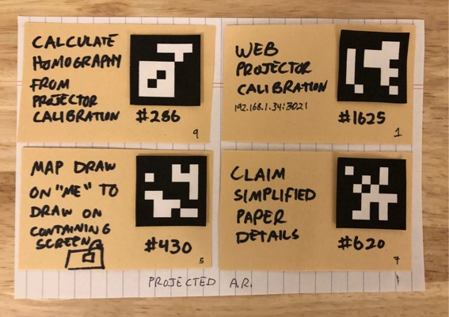
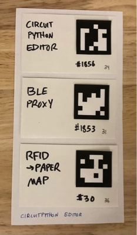
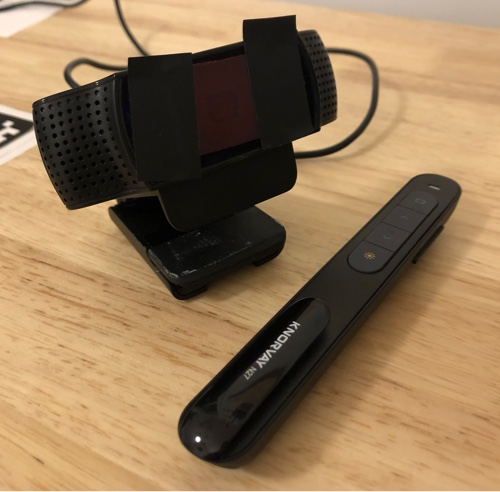
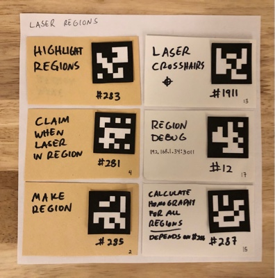

# Growing a Space

## Basic Starting Point

ArUco camera vision using a web browser on a computer monitor as output.

#### Demo: Hello World
- Create a new program using the 1014 web editor at `localhost:3020`
- Put in this code:
  ```
  const { room, myId, run } = require('../helpers/helper')(__filename);

  let ill = room.newIllumination()
  ill.fontcolor(255, 0, 0);
  ill.text(0, 0, "Hello World!")
  room.draw(ill);

  run();
  ```
- Save
- Print out an ArUco ID and tape it to a paper. Write "hello world" on it. You'll need to know the ID of the aruco card.
- Open `localhost:3023` to associate the aruco card ID to the program you just created.
- Now when you place your card on the desk, it should show hello world. When you remove the card, it shows it.



#### Demo: Turtlebot simulation
- Add ArUco cards for:
    - 122 turtlebot simulation
    - 2030 Turtle card
    - 2034 Rainbow card
    - 2036 Emitter card
    - 2035 Spiral card
    - 2033 Pen card
- Run card 1246 web graphics

A simple simulation where the turtlebots behavior is controlled
by the cards placed on the desk. Placing just the Turtle card on the desk
will show a turtlebot randomly wandering on the screen. At most,
laying out the emitter, turtle, pen, spiral, and rainbow in a line will
cause a stream of turtlebots to leave a rainbow path behind.
Different combinations of cards produce different effects.





## Extension: Projected Augmented Reality

Adding a projector allows the graphical output to be projected on the physical programs on the table. This jump makes the programs feel like real objects rather than just a way to turn on/off programs physically.

**Additional Setup Required:**

1. Setup a projector. If you are using a table-based setup then that involves figuring out how to mount a projector vertically down. Throw ratios are important when figuring out how far the projector needs to be mounted away to achieve a certain image size. The view of the webcam should be larger than the projected region for calibration.
2. Add ArUco cards for:
    - 286 calculate homography from projector calibration
    - 1625 web projector-camera calibration
    - 430 Maps a programming drawing on "themselves" to associated graphical output. Important when there are multiple graphical outputs.
    - 620 Claim simplified program details like width, angle, etc. Mainly for convenience.
    - 
3. Do projector calibration. Open localhost:3021 and select the corners of the projector's output using (1) for the top left (2) for the top right (3) for the bottom right (4) for the bottom left.
    - TODO: add screenshot
4. Add a programs that draws on itself like this:
    - ```
      let ill = room.newIllumination();
      ill.fontsize(300);
      ill.fontcolor("white");
      ill.text(0, 0, `Hello World!`);
      room.draw(ill);
      ```
    - TODO: add picture

**Demos:**

- Dynamic Photobook
  - just a book with programs inside that draw things
  - you can draw images like this:
    ```
    let ill = room.newIllumination()
    ill.image(30, 30, 360*2, 240*2, "https://haiperspace.com/writing/20-02-11-rfid-cards/rfid-card-cover.png")
    room.draw(ill)
    ```
  - or show videos:
    ```
    let ill = room.newIllumination()
    ill.text(0, 0, "test")
    const base = "/home/pi/programmable-space/src/files/";
    ill.video(0, 0, 360*2, 240*2, base + "Big_Buck_Bunny_360_10s_1MB.mp4")
    room.draw(ill)
    ```
  - Show maps:
    ```
    let ill = room.newIllumination()
    ill.text(0, 0, "test")
    let lat = -74.0060;
    let long = 40.7128;
    let zoom = 12.13;
    let access_token = process.env.MAPBOX_TOKEN;
    let u = `https://api.mapbox.com` +
    `/styles/v1/mapbox/streets-v11/static/` +
    `${lat},${long},${zoom},0/` +
    `300x200` +
    `?access_token=${access_token}`
    ill.image(30, 30, 360*2, 240*2, u)
    room.draw(ill)
    ```
- Hand-drawn animations
  - 401 sub frame animation and 1640 see light blobs
- Editing Papers on the Desk
  - Add ArUco cards for:
    - 277 pointing at (Figures out with programs are "above" each other and claims that to the room)
    - 1013 text editor
    - 650 keyboard proxy (Listens for keyboard presses and claims them to the room)
  - When you place a program above the 1013 text editor then you should see
    the program's source code projected.

## Extension: Multi-computer, single broker setup

I use a lot of Raspberry Pi's (or other computers) to separate brokers from the main broker computer to get more graphical output, get more camera inputs, hide computers inside devices, etc. These computers can run regular programmable space programs but with the `PROG_SPACE_SERVER_URL` environment variable set to the host computer running the broker. These programs won't be run by default though. A simple approach is to ssh into the computer and manually run the program from the command line but at this point I usually use this setup:

* Have the computer run the 1901 remote process manager program at boot after the computer connects to the network. This program checks for a connection to the host computer and listens for claims that wish the computer would run shell commands.
```
room.on(`wish $code would be running on "${MY_COMPUTER_NAME}"`, results => ...)
```
* On the main computer, I then run 1902 remote start commands to descibe the commmands that each computer should be running.
```
room.assert(`wish`, ["text", MY_COMMANDS.replace(/"/g, String.fromCharCode(9787))], `would be running on`, ["text", target]);
```

## Extension: Thermal printer (EPSON ESC/POS Thermal Printer)

**Additional Setup Required:**

* Get an [Epson TM-T20II Thermal Printer](https://www.amazon.com/gp/product/B005F1D948?psc=1). You could probably get a different variant of the Epson T20
* Get a raspberry pi (I use a Raspberry Pi Zero with WiFi) as the main computer
* Get a USB B (for thermal printer) to USB micro OTG (for raspberry pi) cable
* Run 1901 remote process manager on the raspberry pi at boot
* Run 1902 to claim the raspberry pi should run this:
  ```
  sudo pkill -f '1855__thermalPrinterEscpos.py'
  sudo -E python3 src/programs/1855__thermalPrinterEscpos.py &
  ```

## Extension: Making Electronic Devices via CircuitPython

Add physical objects as inputs/outputs into the programmable space. Have button presses be inputs. Have motors be physical outputs from the space. Make custom and unique objects that integrate with the space.

**Additional Setup Required:**

* Make the program detecting stand
* Get CircuitPython boards like Raspberry Pi Pico or Adafruit CLUE and generic electronics making supplies from supplies like Adafruit
* Powered USB Hub (I had issues with electronic boards drawing too much power)
* Run the following programs:
  * 1856 Circuit Python Editor. Main program of detecting what boards are plugged in via USB, reprogramming the boards, parsing input from the program detecting stand, handling web requests
    * This program needs to be run as the root (sudo) user so currently it cannot be run as an ArUco card detected by computer vision.
  * 1853 Bluetooth Low Energy proxy from devices to the programmable space. Automatically connects to BLE devices. Allows CircuitPython electronic devices to be easy input or outputs to the room
  * 30 RFID card ID to program map.
* Additionally, make new programs for program you want to program to boards. Then associate the program ID with the ID of an RFID card by editing the 30 RFID card map program.
* Printing code via a thermal printer: depends on all setup from the EPSON thermal printer extension



**Things you can make:**

See demos and more explanation in [this blog post](https://haiperspace.com/writing/21-04-19-circuitpython-editor/)
- Activity tracker
- plant sensor + dashboard
- lights on bookshelf for searching
- button to save picture of desk
- RFID card inputs
- ...lots of things

## Extension: Laser Pointer Regions

Use a laser pointer as the equivalent of a wireless mouse cursor of the room. My favorite way to make existing objects on walls (posters, maps, calendars, ...) interactive.

**Additional Setup Required:**

* This requires all the same setup as projected AR extension but with a different camera to sense laser pointer dots instead of running ArUco card computer vision. I also usually run this on a different computer than the main broker.
* Bill of Materials I am using:
  * Webcam: Logitech C920 webcam with a [red gel filter](https://www.amazon.com/Pangda-Colored-Overlays-Correction-Transparent/dp/B073XJMS39?psc=1) taped in front of the lens
  * [Combination red laser pointer with keyboard shortcuts](https://www.amazon.com/KNORVAY-Laser-Presentation-Hyperlink-PowerPoint/dp/B00XVW6UJO)
  * Raspberry Pi 4 computer
  * Projector: [Nebra Anybeam Raspberry Pi Hat](https://www.nebra.com/products/nebra-anybeam-hat-laser-projector-for-the-raspberry-pi)
* By taping the red gel filter and turning the exposure setting of the webcam down very low, most visible light is filtered out except the bright red right from a laser pointer. A simple OpenCV program thresholds the image and claims all bright blobs as laser pointer cursors in the room.
  * 
* Projector and camera nees to be calibrated. 
  * I usually do this by shining the laser at a corner, refreshing the web project calibration page to save that frame, and then clicking on corner.
* Additionally, add cards for:
  * 285 state manager for making new regions
  * 12 web debug program for regions. Also used as the UI to make new regions
  * 1911 draw a "cursor" where the laser pointer is
  * 281 claim when laser cursor is inside a region
  * 283 helper program to highlight regions
  * 287 helper to calculation the transform so you can project map graphics onto a specific region
  * 
* The computer should run the 1901 program after booting
* Make an card for 1902 and run claim something like this to setup the other computer:
  * ```
    pkill -f "processing/graphics"
    pkill -f "python3"
    v4l2-ctl \
      --set-ctrl=brightness=10 \
      --set-ctrl=contrast=0 \
      --set-ctrl=saturation=-100 \
      --set-ctrl=sharpness=128 \
      --set-ctrl=exposure_absolute=50
    export DISPLAY=:0
    export PROG_SPACE_SERVER_URL="XXX.XXX.X.XX"
    python3 src/programs/1620__seeLaser.py 1998 &
    /home/pi/processing-3.5.3/processing-java --output=/tmp/processing/ --sketch=src/processing/graphics --force --present 1998
    ```

**Things you can make:**

- [Musical posters](https://twitter.com/jhaip/status/1299815186493300740)
- [Restaurant map](https://haiperspace.com/writing/19-09-08-physical-programming/#laser-regions)
- [Calendar input](https://vimeo.com/400827615)
- Running map

## Extension: Dot-Paper Detection

Have programs represented as papers with colored dots in the corners that refer to their program IDs. A computer vision program takes in webcam frames and claims the location of papers to the room. Inspired by the [Dynamicland](https://dynamicland.org/) and [Paper Program](https://paperprograms.org/) colored dot papers.

* Setup a webcam. Webcam settings should be tuned so have good color balance (not too warm or too cool) for the best color detection of the paper dots.
* Run 1601 frame-to-papers.go
* Run 1382 print-paper.go to generate PDFs with program source code and the corresponding colored dots in the corners
* Run 498 printing manager so the papers are printed. Have `lpr` installed and setup with with a default printer.